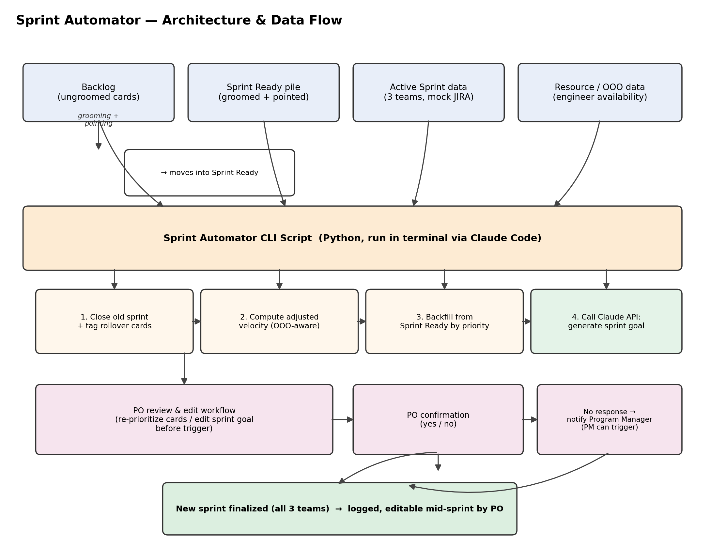

# Sprint Automator — Product Requirements Document

**Author:** Asha Veerpaneni — Program Manager / Scrum Master
**Status:** Draft v1
**Last updated:** August 13, 2026

## 1. Problem Statement
Sprint planning is repeated manually every cycle across 3 teams: closing the old sprint, identifying rollover work, backfilling capacity from the backlog, and getting Product Owner sign-off. This is repetitive, error-prone at scale, and takes up ceremony time that could go toward actual planning conversations. This project automates the mechanical parts of that ceremony using mock JIRA data, while keeping the Product Owner as the final decision-maker.

## 2. Goals
1. **Learning goal:** Learn to direct an AI coding agent (Claude Code) to build a working automation tool, with attention to data-processing performance, token/cost efficiency, and ease of use.
2. **Career goal:** Produce a portfolio-quality project, documented and hosted on GitHub, that demonstrates both PM judgment and hands-on delivery for job applications.
3. **Technical fluency goal:** Understand the API calls, system architecture, and data flow well enough to explain them in an interview and identify where the workflow could be optimized.

## 3. Users
- **Primary user:** Program Manager (you) — runs the tool at the start of each sprint cycle.
- **Secondary stakeholder:** Product Owner per team — reviews and confirms the proposed new sprint before it's finalized.

## 4. Scope

### In scope (v1)
- Mock JIRA dataset representing 3 teams, their velocities, active sprints, and backlogs
- A **Sprint Ready** pile/category, separate from the raw Backlog: cards move to Sprint Ready only once groomed and pointed. The new sprint pulls only from Sprint Ready, never directly from the ungroomed Backlog.
- Given a sprint start/end date, close the old sprint for all 3 teams
- Identify incomplete ("rollover") cards from the closed sprint
- Open a new sprint per team, populate with rollover cards + additional high-priority cards from the Sprint Ready pile, up to that team's velocity
- Adjust effective team velocity for resource availability (e.g. engineers marked out-of-office during the sprint window), rather than assuming full velocity every cycle
- Generate the sprint goal using AI based on the actual prioritized cards being pulled into the sprint (not a generic summary of whatever ended up in the sprint)
- Give the Product Owner a workflow to review and re-prioritize cards, or adjust the sprint goal, *before* the sprint is triggered — not just a yes/no confirmation on a fixed proposal
- Give the Product Owner edit access to re-prioritize or swap cards *after* the sprint is finalized, since priorities can legitimately shift mid-sprint
- Present a summary (proposed cards, sprint goal, total points vs. adjusted velocity) and require explicit PO confirmation before finalizing
- Runs from the terminal (CLI), no graphical interface required for v1

### Out of scope (v1)
- Real JIRA API integration (mock data only)
- Multi-user auth/permissions
- Notifications/emails to teams

### Possible v2 (after v1 works)
- Simple HTML dashboard as a front end
- Support for more than 3 teams / configurable team count
- Basic historical reporting (velocity trend over past sprints)

## 5. User Stories & Acceptance Criteria

**US-1:** As a Program Manager, I want to provide a sprint start and end date so the tool knows the new cycle's boundaries.
- *Acceptance:* Tool accepts two dates and validates end date is after start date.

**US-2:** As a Program Manager, I want the old sprint automatically closed and incomplete cards flagged as rollover, so I don't have to manually audit each board.
- *Acceptance:* For each team, cards not marked `done` in the closed sprint are tagged as rollover and carried to the new sprint.

**US-3:** As a Program Manager, I want the new sprint backfilled with high-priority cards from the Sprint Ready pile up to each team's velocity, so sprints stay realistically scoped and only groomed work enters a sprint.
- *Acceptance:* New sprint's total story points do not exceed adjusted team velocity; cards are pulled only from Sprint Ready (never raw Backlog) by priority (high → medium → low) until velocity is reached or the pile is exhausted. Ungroomed or unpointed cards are never pulled in (see tie-breaking rule, Section 7).

**US-4:** As a Product Owner, I want to review and confirm the proposed sprint before it's finalized, so I retain control over what my team commits to.
- *Acceptance:* Tool prints a summary per team (cards, sprint goal, points vs. adjusted velocity) and requires a yes/no input before committing. A "no" halts finalization for that team.

**US-5:** As a Product Owner, I want to re-prioritize cards or edit the sprint goal before the sprint is triggered, so the proposal reflects my judgment, not just the algorithm's default ordering.
- *Acceptance:* Before final confirmation, PO can reorder/swap cards from Sprint Ready and edit the draft sprint goal; the summary shown for confirmation reflects those edits.

**US-6:** As a Program Manager, I want the sprint goal generated by AI based on the specific prioritized cards in the sprint, so it reads as an intentional goal rather than a list recap.
- *Acceptance:* Sprint goal text is generated from the top-priority themes of the selected cards, not a template that just lists card titles.

**US-7:** As a Program Manager, I want team velocity adjusted for known resource availability (e.g. OOO engineers), so sprint capacity reflects who's actually available.
- *Acceptance:* Given OOO data for a team's sprint window, effective velocity is reduced proportionally before backfilling cards; the summary shows both baseline and adjusted velocity.

**US-8:** As a Product Owner, I want to edit or re-prioritize cards after the sprint is finalized, so I can respond to legitimate priority changes mid-sprint.
- *Acceptance:* PO can swap or re-prioritize cards within an active sprint; changes are logged with a timestamp and reason.

## 6. Non-Functional Requirements
- **Performance:** Full sprint transition for all 3 teams completes in under 10 seconds of processing time (excluding time waiting on PO input).
- **Cost/token efficiency:** Track approximate token usage per run; note it in the README as a measured result, not just a claim.
- **Usability:** A first-time user (including non-technical stakeholders) should be able to run the tool and understand the output without reading code.
- **Reliability:** Tool must handle the edge cases in Section 7 without crashing.

## 7. Risks & Edge Cases
- Not enough cards in Sprint Ready to fill a team's adjusted velocity → tool should report remaining capacity rather than error out.
- **Tie-breaking rule (conflicting priority):** when two cards have conflicting priority, the card listed first (first-come, first-served in the Sprint Ready pile) is added to the sprint ahead of the other. Cards that are not prioritized or not pointed are never added to a sprint, regardless of order.
- **PO does not respond / declines confirmation:** the Program Manager is notified so they can trigger the sprint themselves. Work must not stall indefinitely waiting on PO input — a new sprint should still be initiated, with the PO's non-response/decision logged for follow-up.
- Rollover cards alone exceed adjusted velocity → tool should flag this explicitly rather than silently dropping Sprint Ready additions.
- Resource availability data (OOO) missing or incomplete → default to full baseline velocity and flag that adjusted velocity could not be calculated, rather than guessing.
- **Claude API unavailable or fails** (no key set, network error, safety refusal, empty response): fall back to a deterministic, offline goal naming the top 1–2 highest-priority committed cards (e.g. *"This sprint focuses on: Payment retry queue logic and Add SSO login option."*), rather than blocking the sprint or showing empty/generic placeholder text. AI-generated goals remain the preferred path whenever the API is available; the fallback is free and requires no credentials.

## 8. Success Metrics
- 100% of incomplete cards correctly identified as rollover against the mock dataset's known state.
- New sprint point totals stay within team velocity for all 3 teams.
- End-to-end run time under the 10-second target (Section 6).
- Qualitative: a non-technical reviewer (e.g. a Product Owner) can understand the confirmation summary without explanation.

## 9. Technical Approach (initial)
- Mock data stored as JSON (see `mock_jira_data.json`)
- Core logic built and tested as a terminal/CLI script first
- Confirmation step as a terminal yes/no prompt in v1
- Git used from the first commit; pushed to a public GitHub repo
- HTML front end deferred to v2, once core logic is proven
- Sprint goal generation (US-6) uses **Claude Haiku 4.5** (`claude-haiku-4-5`) — chosen because grounding a 1–2 sentence goal in a short card list is a simple, well-scoped generation task that doesn't need a larger, more expensive model. Falls back to the free offline template described in Section 7 whenever the API isn't available.

## 10. Definition of Done (v1)
- Script runs end-to-end against the mock dataset for all 3 teams
- All 8 user stories pass their acceptance criteria
- README documents the problem, approach, and how to run it
- Code is committed incrementally to a public GitHub repo with a clear history

## 11. Architecture & Data Flow

**How to read this, for interview purposes:**

- **Data layer (top row):** Four inputs feed the system — the raw Backlog, the Sprint Ready pile (cards that have been groomed and pointed), the current Active Sprint state for all 3 teams, and Resource/OOO data. Cards move from Backlog into Sprint Ready only through grooming; the automation never pulls directly from an ungroomed Backlog.
- **Logic layer (middle):** The core CLI script, run through Claude Code, performs four steps in sequence: close the old sprint and tag rollover cards; compute each team's adjusted velocity by factoring in OOO engineers; backfill the new sprint from Sprint Ready by priority (applying the tie-breaking rule in Section 7); and call the Claude API to generate a sprint goal grounded in the actual selected cards, not a generic summary.
- **Human-in-the-loop layer (bottom):** Before anything is finalized, the Product Owner gets a review/edit workflow to re-prioritize cards or adjust the sprint goal, then a confirmation step. If the PO doesn't respond, the Program Manager is notified and can trigger the sprint so work isn't blocked indefinitely.
- **Outcome:** The new sprint is finalized across all 3 teams, logged, and remains editable by the PO mid-sprint if priorities shift.

**Where this could be optimized (a good talking point for interviews):** the velocity-adjustment and backfill steps (2 and 3) are pure logic and run fast/cheap; the AI sprint-goal step (4) is the only place that calls out to the Claude API, so it's the main lever for token cost — worth measuring separately from the rest of the pipeline once built.

## 12. Measured Results (v1, as built)

These are the actual numbers from the completed build, not projections — kept here per Section 6's requirement that cost/performance be reported as measured results, not claims.

- **Test coverage:** 80 automated tests (`pytest`), covering all 8 user stories — data validation, rollover tagging, OOO velocity adjustment (even split, floor rounding, missing/incomplete data), backfill priority/tie-breaking/edge cases, AI + template-based goal generation, PO edit/confirm flows, mid-sprint editing with change-log persistence, and full end-to-end CLI runs.
- **AI model:** Claude Haiku 4.5 (`claude-haiku-4-5`), one API call per team per sprint cycle (3 calls for a full 3-team run).
- **Token usage & cost:** the tool prints real measured usage at the end of every run (`AI sprint-goal generation time: X.XXXs (N input / M output tokens)`) — never an estimate. Without an API key set, this is genuinely `0 input / 0 output tokens` (the free template fallback runs instead, per Section 7). With a key set, a full 3-team run's prompts are short (a handful of card titles/priorities each) — at Haiku 4.5's published rate of $1 / $5 per million input/output tokens, a realistic run costs on the order of **$0.001 or less**, i.e. a fraction of a cent.
- **Timing:** the pure-logic pipeline (close sprint, adjust velocity, backfill) for all 3 teams measures at **~0.002s**, well under the 10-second NFR budget (Section 6). The AI goal-generation step is timed separately per Section 11's optimization note; three sequential Claude calls typically complete in **1–2 seconds** total.
- **PO input parameters** — everything a Product Owner or Program Manager is asked for during a run:
  - New sprint start date and end date (`YYYY-MM-DD`)
  - Per team, at the confirmation step: `confirm` / `edit` / `decline`
  - If editing before confirmation (US-5): add or remove a specific Sprint Ready card, or rewrite the draft sprint goal
  - When editing an already-active sprint (US-8): add or remove a specific card, plus a required typed reason (logged with a timestamp)
